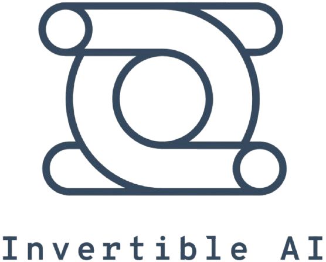

<p align="center" width="100%">
    <a></a>
</p>

# NileChat: Towards Linguistically Diverse and Culturally Aware LLMs for Local Communities
<p align="center">
    <a href="https://scholar.google.com/citations?user=0hheG2YAAAAJ" target="_blank">Abdellah El Mekki</a>,
    <a href="#" target="_blank">Houdaifa Atou</a>,
    <a href="#" target="_blank">Omer Nacar</a>,
    <a href="#" target="_blank">Shady Shehata</a>,
    <a href="https://mageed.arts.ubc.ca/" target="_blank">Muhammad Abdul-Mageed</a>
</p>
<p align="center" float="left">
  
  
    
</p>


[](https://huggingface.co/UBC-NLP/NileChat-3B)
[](https://huggingface.co/collections/UBC-NLP/nilechat-pre-training-data-682fa0e96e6d610c32099ef5)
[](https://arxiv.org/abs/2505.18383)
[]()


Enhancing the linguistic capabilities of Large Language Models (LLMs) to include low-resource languages is a critical research area. Current research directions predominantly rely on synthetic data generated by translating English corpora, which, while demonstrating promising linguistic understanding and translation abilities, often results in models aligned with source language culture. These models frequently fail to represent the cultural heritage and values of local communities. This work proposes a methodology to create both synthetic and retrieval-based pre-training data tailored to a specific community, considering its (i) language, (ii) cultural heritage, and (iii) cultural values. We demonstrate our methodology using Egyptian and Moroccan dialects as testbeds. As a proof-of-concept, we develop NileChat, a 3B parameter LLM adapted for Egyptian and Moroccan communities, incorporating their language, cultural heritage, and values. Our results show that NileChat outperforms existing Arabic-aware LLMs of similar size and performs on par with larger models. We share our methods, data, and models to promote inclusion of more diverse communities in LLM development.

<p align="center" width="100%">
    <a href="https://github.com/UBC-NLP/nilechat" target="_blank">GitHub</a> |
    <a href="https://arxiv.org/abs/2505.18383" target="_blank">Paper</a>
</p>

<div style="text-align: center; width: 100%;">
    <a></a>
    <p style="text-align: center;">
        <em>Proposed framework for data augmentation tailored to low-resource local communities. (a) Workflow for generating educational data in the target language through machine translation. (b) Workflow for generating diverse text genres in the target language by simulating scenarios that incorporate local cultural contexts and persona descriptions. (c) Retrieval process for augmenting local cultural knowledge by parsing web pages representing specific local cultural concepts through web search.</em>
    </p>
</div>

---

- [Overview](#overview)
- [Data Augmentation](#data-augmentation)
  - [MT for Knowledge and Fluency](#mt-for-knowledge-and-fluency)
  - [Controlled Generation for Cultural Heritage and Values](#controlled-generation-for-cultural-heritage-and-values)
  - [Retrieval for Local Cultural Heritage](#retrieval-for-local-cultural-heritage)
- [NileChat Model](#nilechat-model)
- [Evaluation](#evaluation)
- [Using Models](#inference)
- [Citation](#citation)
---

## Overview
Large Language Models (LLMs) have advanced rapidly but show performance disparities for non-English, particularly low-resource languages and dialects. This is often due to limited diverse multilingual data in pre-training corpora. A deeper issue is cultural encapsulation, where LLMs internalize and propagate dominant cultural perspectives from their training data. This paper addresses adapting multilingual LLMs to low-resource communities by considering linguistic characteristics, cultural heritage, and values. We propose a data augmentation pipeline for continued pre-training, combining controlled synthetic data generation and retrieval methods.

---

## Data Augmentation
Our data production method encapsulates three dimensions for a given country-level population: (i) Language, (ii) Cultural Heritage, and (iii) Cultural Values (LHV). The approach uses machine translation, controlled generation, and retrieval.

### MT for Knowledge and Fluency
We translate educational content from English into the target low-resource language using a teacher model (Command R+ 104B) to ensure linguistic fluency and coherence. We focus on high-quality educational materials for their topical breadth. For Egyptian (EGY) and Moroccan (MOR) Arabic dialects, we translated 5.5 million texts from Fineweb-edu.

### Controlled Generation for Cultural Heritage and Values
To imbue cultural relevance, we employ controlled generation using a teacher LLM to generate diverse texts reflecting specific cultural heritage concepts and local persona descriptions. This integrates:
* Local Contextual Information from news websites.
* Core Cultural Heritage Concepts from country-specific Wikipedia portals.
* Linguistic and Cultural Expressions collected from various local sources.
* Representative Personas developed from World Values Survey (WVS) data.
We generate genres like stories, personal essays, blog posts, reviews, and conversations.
* For EGY, ~300,000 samples for each category were generated.
* For MOR, ~150,000 samples for each category were generated.

### Retrieval for Local Cultural Heritage
This method involves querying a search engine (Brave Search API) with a pre-defined list of cultural concepts. Top search results (excluding social media) are parsed for textual content.
* Retrieved 110,000 articles for EGY and 30,000 for MOR.

The public release of these new datasets represents the largest publicly available corpora for Egyptian and Moroccan Arabic dialects. The final pre-training dataset mixture contains 98.57 billion words.

---

## NileChat Model
NileChat is a 3-billion parameter LLM adapted for Egyptian and Moroccan communities. We continued pre-training Qwen-2.5-3B with our augmented data. The model demonstrates proficiency in both Egyptian and Moroccan dialectal Arabic (Arabic script and Arabizi), while maintaining strong performance in Modern Standard Arabic, French, and English.
Supervised fine-tuning (SFT) was performed using a constructed comprehensive training set, including translated datasets (SmolTalk, TULU-V2-mix) and synthetically generated dialectal QA pairs. We fine-tuned two separate variants (EGY and MOR) and merged them using weighted linear averaging to create NileChat.

---

## Evaluation
NileChat was evaluated on understanding, translation, cultural knowledge, and value alignment benchmarks.
* **Understanding**: Outperformed its baseline (Qwen2.5-3B-instruct) by ~10 points on MMLU, HellaSwag, and Belebele for EGY and MOR. It also outperformed larger models like AceGPT-13B and Jais-13B.
* **Cultural Knowledge (Palm benchmark)**: Achieved scores of 5.72 (EGY) and 5.86 (MOR), significantly up from baseline Qwen2.5-3B-instruct scores of 2.86 and 2.31, respectively.
* **Translation (Flores-200 & in-house dataset)**: Achieved the highest average translation quality (spBLEU: 21.32) among evaluated models, including NLLB-200-3.3B (18.29). On the in-house dataset, NileChat significantly outperformed all baselines.
* **Value Alignment (WVS-based)**: Demonstrated substantial improvements over the baseline across most societal-value dimensions for both Moroccan and Egyptian contexts.

<div style="text-align: center; width: 100%;">
    <a></a>
  <p style="text-align: center;">
        <em>Zero-shot performance of models on under- standing and cultural knowledge evaluations. Metrics are accuracy for MMLU, HellaSwag, and Belebele, and a 0-10 correctness score for Palm. Bold values indicate the highest score among models comparable in size to ours (< 7B). Underlined values represent the highest score in the entire column, including larger models.</em>
    </p>
</div>


<div style="text-align: center; width: 100%;">
    <a></a>
  <p style="text-align: center;">
        <em>Zero-shot translation performance (spBLEU) on the Flores and in-house datasets. XX →EGY and XX →MOR denote average over target languages EGY and MOR, respectively. Conversely, EGY → XX and MOR → XX indicate average over EGY and MOR as source languages. Bold values highlight the top score among models with fewer than 7 billion parameters. Underlined values indicate the highest score overall in each column.</em>
    </p>
</div>

Performance starts to get a large boost during the first 10B pre-training tokens and becomes steady after around 60B tokens.

---

## Download Resources for NileChat

- Fineweb-edu-Morocco and Fineweb-edu-Egypt represent the Fineweb-edu dataset translated from English into Moroccan and Egyptian Arabic dialects, respectively.

- LHV-Morocco and LHV-Egypt comprise stories, personal essays, blog posts, reviews, and conversations that reflect the language, cultural heritage, and cultural values of Moroccan and Egyptian communities, respectively.

- Arabizi-Morocco and Arabizi-Egypt represent the transliteration of a portion of the Fineweb and LHV datasets into Arabizi for both Moroccan and Egyptian dialects, respectively.

| Type  | Name                       | Hugging Face Link                                                                                                                                   |
| :---- | :------------------------- | :-------------------------------------------------------------------------------------------------------------------------------------------------- |
| Data  | Fineweb-edu-Morocco| [](https://huggingface.co/datasets/UBC-NLP/fineweb-edu-Morocco) |
| Data  | Fineweb-edu-Egypt  | [](https://huggingface.co/datasets/UBC-NLP/fineweb-edu-Egypt) |
| Data  | Arabizi-Egypt      | [](https://huggingface.co/datasets/UBC-NLP/Arabizi-Egypt)      |
| Data  | Arabizi-Morocco    | [](https://huggingface.co/datasets/UBC-NLP/Arabizi-Morocco)    |
| Data  | LHV-Egypt          | [](https://huggingface.co/datasets/UBC-NLP/LHV-Egypt)          |
| Data  | LHV-Morocco        | [](https://huggingface.co/datasets/UBC-NLP/LHV-Morocco)        |
| Model | NileChat-3B                   | [](https://huggingface.co/nilechat)                   |

---

## Inference

Inference can be done using your prefered LLM serving tool, we provide below code that you can use for `transformers` and `vllm`.

### 🤗 Transformers

```python
import torch
from transformers import AutoModelForCausalLM, AutoTokenizer

model_id = "UBC-NLP/NileChat-3B"
model = AutoModelForCausalLM.from_pretrained(
    model_id,
    torch_dtype=torch.bfloat16,
    device_map="auto"
)

tokenizer = AutoTokenizer.from_pretrained(model_id)

```

### ⚡️ vLLM

To run NileChat-3B on vLLM, you can refer to the following command:

```bash
vllm serve UBC-NLP/NileChat-3B --tensor-parallel-size 1 --data-parallel-size 1
```

## Citation
Please cite this paper if you use our data or models.
```bibtex
@misc{mekki2025nilechatlinguisticallydiverseculturally,
      title={NileChat: Towards Linguistically Diverse and Culturally Aware LLMs for Local Communities}, 
      author={Abdellah El Mekki and Houdaifa Atou and Omer Nacar and Shady Shehata and Muhammad Abdul-Mageed},
      year={2025},
      eprint={2505.18383},
      archivePrefix={arXiv},
      primaryClass={cs.CL},
      url={https://arxiv.org/abs/2505.18383}, 
}
```

## Acknowledgments
We acknowledge support from Canada Research Chairs (CRC), the Natural Sciences and Engineering Research Council of Canada (NSERC; RGPIN-2018-04267), the Social Sciences and Humanities Research Council of Canada (SSHRC; 895-2020-1004; 895-2021-1008), Canadian Foundation for Innovation (CFI; 37771), [Digital Research Alliance of Canada](https://alliancecan.ca), and [UBC Advanced Research Computing-Sockeye](https://arc.ubc.ca/ubc-arc-sockeye).

## Contact
For any queries, please contact Abdellah El Mekki (4mekki4@gmail.com) or Muhammad Abdul-Mageed (muhammad.mageed@ubc.ca).
